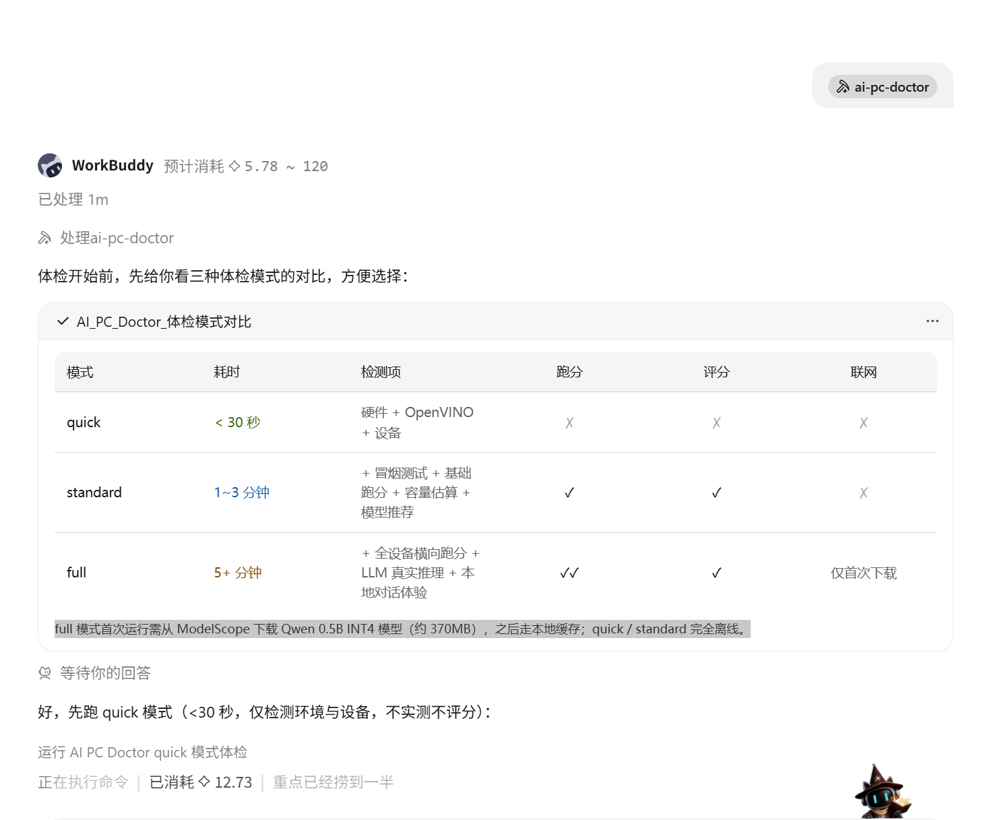
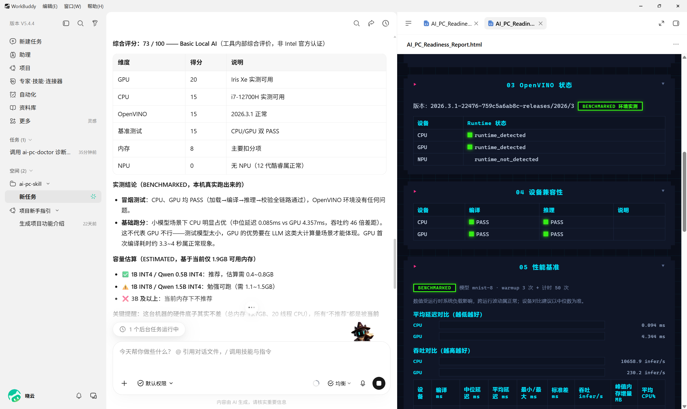
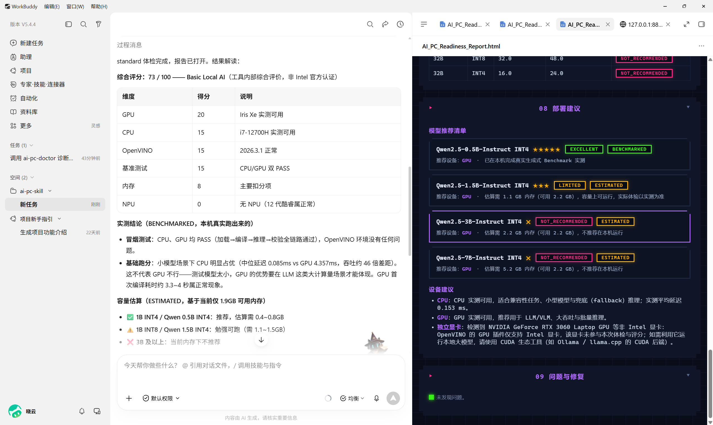
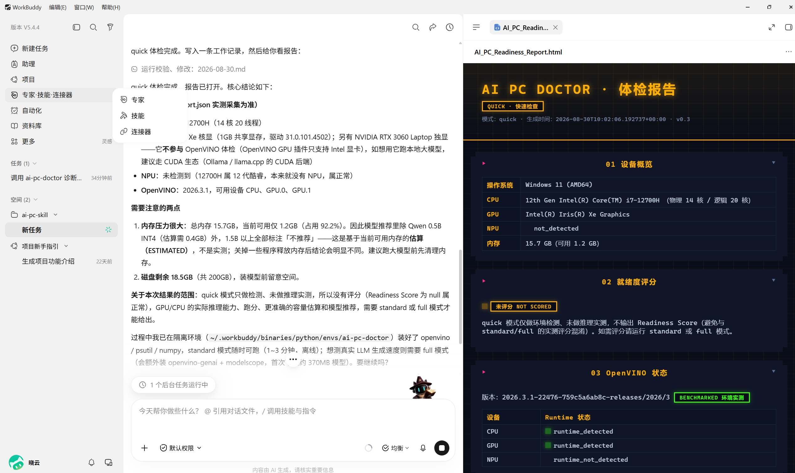
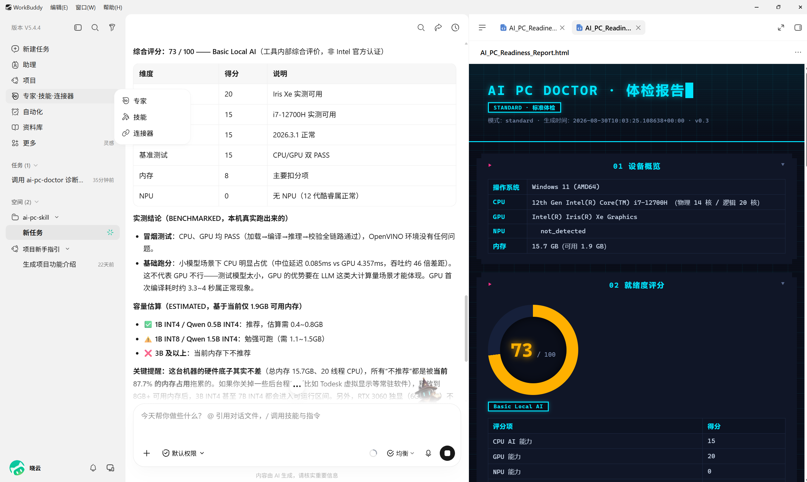
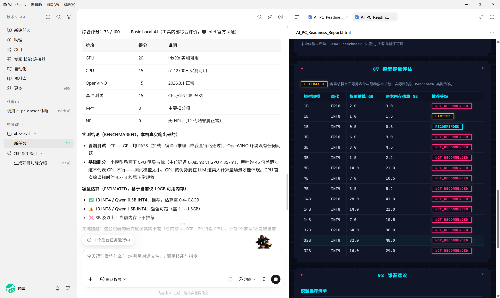
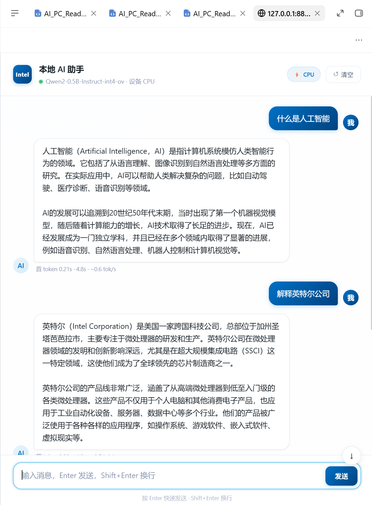
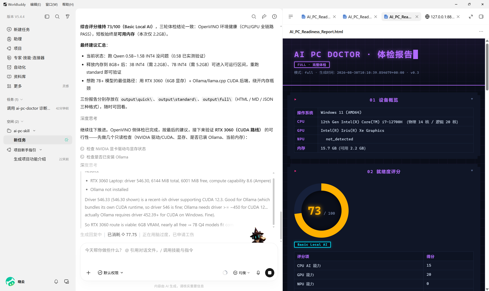

# AI PC Doctor：给 AI PC 做一次「上岗体检」——基于WorkBuddy + OpenVINO 的本地模型部署体检 Skill

> **一句话总结**：AI PC Doctor 不只是告诉你电脑有什么硬件，而是通过真实的 OpenVINO 推理测试告诉你：这台电脑到底适不适合跑本地 AI、能跑多大的模型、应该跑在哪个设备上，以及实际能跑多快。
>
> - Skill 作品：AI PC Doctor（已发布魔搭 Skills 中心，标签：AI PC）
> - 参赛活动：英特尔 x 魔搭社区 Production AI Skills 大赛（第三期）
> - 技术栈：OpenVINO / OpenVINO GenAI、Qoder / WorkBuddy / TRAE Work、ModelScope

---

## 一、为什么做这个 Skill：一个真实到有点尴尬的痛点

AI PC、Intel Core Ultra、NPU、OpenVINO 这些概念越来越热，越来越多人想在个人电脑上跑本地大模型。但真正动手时，几乎每个用户都要先回答一串问题：

```
我的电脑算不算 AI PC？
有没有 NPU？驱动装对了吗？
OpenVINO 装了吗？能识别我的 GPU / NPU 吗？
1B / 3B / 7B / 14B，我的机器到底能跑哪个？
模型应该跑 CPU、GPU 还是 NPU？
首 Token 要等多久？每秒能生成多少 Token？
```

这些信息散落在系统设置、设备管理器、Intel 驱动面板、Python 环境和各种 Benchmark 工具里。**普通用户查不齐，开发者懒得查，企业售前没时间逐台查。**

更有意思的是：AI Agent 时代到来之后，用户问 Agent 的第一批问题里，往往就有「我这台电脑能跑本地 AI 吗」。但 LLM 自己**回答不了**这个问题——它看不到你的硬件，如果硬答，就是在编。

所以我做了 AI PC Doctor：一个面向生产力 Agent 的本地 AI 部署体检 Skill。用户只需要对 Agent 说一句「帮我检查一下这台电脑适不适合跑本地 AI」，剩下的全部自动完成。

**它回答四个问题：**

1. 这台电脑**能不能**跑本地 AI？
2. **能跑多大**的模型？
3. 应该跑在**哪个设备**上（CPU / GPU / NPU）？
4. 实际**能跑多快**（TTFT / TPOT / tokens/s）？

---

## 二、产品设计：从「硬件信息」到「部署决策」

市面上的工具分两类：

- **硬件检测工具**（如设备管理器、AIDA64）：告诉你 CPU 是什么、内存多大——但不说这跟 AI 有什么关系；
- **Benchmark 工具**：告诉你跑分——但不解释这个分数意味着什么。

AI PC Doctor 的定位是补中间的空白：

> **从 Hardware Information → AI Deployment Decision。**

整体架构是典型的「Agent + Local Tool + AI PC」三层结构：

```text
用户自然语言（"我这电脑能跑 7B 吗"）
        │
        ▼
┌─────────────────────────┐
│  WorkBuddy              │   ← Agent 入口与解释层
│  （读取 SKILL.md）       │
└───────────┬─────────────┘
            │ Skill Call
            ▼
┌─────────────────────────┐
│  AI PC Doctor           │   ← 专业工具能力层
│  System Probe           │     OS / CPU / GPU / NPU / 内存
│  OpenVINO Probe         │     运行时版本 / 可用设备
│  Smoke Test             │     编译 + 真实推理
│  Benchmark Engine       │     延迟 / 吞吐 / TTFT / TPOT
│  Capacity Estimator     │     模型容量估算
│  Deployment Advisor     │     部署建议 + Readiness Score
└───────────┬─────────────┘
            ▼
   report.json + report.md + 交互式 HTML Dashboard
            │
            ▼
   Agent 用自然语言向用户解释结论
```

这个分层的关键在于**职责切分**：

- **数据一律来自真实环境**（系统命令 + OpenVINO Runtime + 实测推理），采集失败就标记 `unknown`，LLM **被禁止猜测硬件**；
- **LLM 只负责理解、解释和建议**，把结构化的 `report.json` 翻译成人话。

这既保证了数据可信度，又发挥了 Agent 的交互优势。

---

## 三、核心功能与工程实现

### 3.1 四层验证：理论能力 ≠ 实测能力

设计的核心原则是：**检测到硬件 ≠ 模型能跑**。因此整个体检分四层递进：

```text
System Probe      → 系统里有什么硬件（OS / CPU / GPU / NPU / 内存）
Runtime Probe     → OpenVINO 能不能看到这些设备
Smoke Test        → 每个设备真实编译 + 推理一次最小模型
Benchmark         → 实测延迟 / 吞吐 / TTFT / TPOT / 峰值内存
```

对应到报告里，每个结论都被显式标记为：

- **ESTIMATED**：基于硬件与模型参数的容量估算（如「7B INT4 估算需 5.2 GB 内存」）；
- **BENCHMARKED**：本机真实推理跑出来的数据（如「TTFT 310 ms，24.3 tokens/s」）。

比如 NPU 的状态只会标记为 `detected / not_detected`，**绝不直接写 supported**——能不能推理，以 Smoke Test 实测为准。这个区分贯穿整个报告，也是这个工具和「跑个分给你看」的本质区别。

### 3.2 三档体检模式：把选择权交给用户，但把信息给足

Skill 提供 quick / standard / full 三档模式：

| 模式 | 耗时 | 检测项 | 跑分 | 评分 | 联网 |
| --- | --- | --- | --- | --- | --- |
| quick | < 30 秒 | 硬件 + OpenVINO + 设备探测 | ✗ | ✗ | ✗ |
| standard（默认） | 1~3 分钟 | + 冒烟测试 + 基础跑分 + 容量估算 + 模型推荐 | ✓ | ✓ | ✗ |
| full | 5+ 分钟 | + 全设备横向跑分 + LLM 真实推理实测 | ✓✓ | ✓ | ✓（首次下载模型） |

一个值得分享的工程细节：当用户没说选哪个模式时，Agent 不会擅自套默认值，而是**先用表格渲染三模式对比，再提问收口**——因为纯文本提问里用户根本分不清三档差异。这是「Skill 不只是脚本，更是 Agent 交互设计」的一个具体体现。



### 3.3 OpenVINO 深度集成：不只是 import 一下

- **设备探测**：通过 `ov.Core().available_devices` 获取运行时真实可见的设备列表，与系统层探测结果交叉验证（OS 看到 NPU 但 OpenVINO 看不到 → 提示驱动/版本问题）；
- **Smoke Test**：使用随仓库分发的 MNIST-8 模型（约 26 KB，**离线可跑、零下载**），对每个设备执行「编译 + 推理 + 输出校验」，状态分为 PASS / FAIL / UNSUPPORTED / SKIPPED；
- **异构 Benchmark**：同一模型分别在 CPU / GPU / NPU 上跑 warmup 3 次 + 计时 50 次，输出中位/平均/最小/最大延迟、标准差、吞吐和峰值内存——用中位数和标准差而不是单次计时，避免偶发抖动误导结论；
- **GenAI Benchmark（full 模式）**：通过 OpenVINO GenAI 加载真实小模型（默认 Qwen2-0.5B-Instruct INT4，约 370 MB，从 **ModelScope** 下载并本地缓存），实测模型加载时间、TTFT、TPOT、tokens/s、峰值内存。

### 3.4 输出：一份可以直接发给老板的报告

体检结果同时产出三份产物：

- `report.json`：结构化数据，供 Agent 或其他工具消费；
- `report.md`：人读版本；
- `AI_PC_Readiness_Report.html`：自包含单页 Dashboard（无 CDN 依赖，离线可打开），包含设备概览、Readiness 评分、OpenVINO 状态、设备兼容性、性能基准、生成式 AI 性能、模型容量评估、部署建议、问题与修复九个板块。





---

## 四、实测效果：WorkBuddy 中的一次真实体检全记录

以下所有内容来自真实运行（非示意数据），验证环境为 WorkBuddy + 一台真实的老款 Intel 笔记本：

```text
OS:  Windows 11 (AMD64)
CPU: Intel Core i7-12700H（物理 14 核 / 逻辑 20 线程）
GPU: Intel Iris Xe Graphics（另有 NVIDIA RTX 3060 Laptop 独显）
NPU: 无（12 代酷睿本就没有 NPU）
RAM: 15.7 GB
OpenVINO: 2026.3.1
```

### 4.1 quick 模式：30 秒出环境结论

用户在 WorkBuddy 里说「帮我检查一下这台电脑适不适合跑本地 AI」，Agent 先渲染三模式对比表让用户选择，随后执行 quick 体检：



结论（全部来自真实采集）：

- CPU i7-12700H、Iris Xe 核显正常识别；**NPU 标记为 not_detected 而非 FAIL**——12 代酷睿本来就没有 NPU，这是正常情况而非故障；
- 检测到 RTX 3060 Laptop 独显，但报告明确指出：**它不在 OpenVINO GPU 插件的体检范围内（该插件仅支持 Intel 显卡）**，想用它跑本地大模型应走 CUDA 生态（Ollama / llama.cpp）；
- quick 模式明确标注「未评分」——没做实测就不出分，避免误导。

### 4.2 standard 模式：评分 73/100，短板定位到「内存」而非硬件



综合评分 **73/100（Basic Local AI）**，分项得分清楚地解释了每一分：

| 维度 | 得分 | 说明 |
| --- | ---: | --- |
| GPU | 20 | Iris Xe 实测可用 |
| CPU | 15 | i7-12700H 实测可用 |
| OpenVINO | 15 | 2026.3.1 正常 |
| 基准测试 | 15 | CPU/GPU 双 PASS |
| 内存 | 8 | **主要扣分项** |
| NPU | 0 | 无 NPU（12 代酷睿属正常） |

冒烟测试 CPU/GPU 均 PASS（加载→编译→推理→校验全链路）。基础跑分出现了一个**只靠纸面配置绝对猜不到的结论**：

```text
小模型场景下 CPU 明显占优：
  CPU 中位延迟 0.085 ms vs GPU 4.357 ms（吞吐相差约 46 倍）
  ——这不是 GPU 不行，而是测试模型太小，
    GPU 的优势要在 LLM 这类大计算量场景才能体现，
    且 GPU 首次编译耗时约 3.3~4 秒属正常现象。
```

容量估算（ESTIMATED）基于实测可用内存给出：当前可用内存仅约 1.9 GB（占用 87.7%），1B/Qwen 0.5B INT4 推荐、3B 及以上不推荐；同时给出关键提醒——**这台机器硬件底子不差，所有「不推荐」都是被当前内存占用拖累的，释放内存到 8GB+ 后 3B/7B INT4 即可进入可运行区间**。



### 4.3 full 模式：真实 LLM 生成实测 + 本地对话体验

full 模式自动从 ModelScope 下载 Qwen2-0.5B-Instruct INT4（约 370 MB），分别在 CPU 和 GPU 上实测生成性能：

| 设备 | 模型加载 | TTFT | TPOT | 吞吐 | 峰值内存增量 |
| --- | ---: | ---: | ---: | ---: | ---: |
| CPU | 4.43 s | 220.7 ms | 49.9 ms | **19.0 tokens/s** | 813.7 MB |
| GPU | 18.81 s | **178.8 ms** | 60.8 ms | 15.3 tokens/s | 1048.7 MB |

这组数据是「实测优先于纸面配置」最好的注脚：**在这台机器的 0.5B 小模型场景下，GPU 首 Token 更快（178.8 ms vs 220.7 ms），但持续生成吞吐反而被 CPU 反超**——如果只看「有 GPU」就建议用户上 GPU，恰恰会给出错误建议。

full 模式最后还会自动启动一个本地对话服务（加载刚测过的模型），用户直接在浏览器里和本地大模型聊天，流式输出、多轮记忆：



Agent 最终汇总：评分维持 73/100，短板始终是可用内存（本次仅 2.2 GB）；跑 Qwen 0.5B~1.5B INT4 没问题（0.5B 已实测验证）；想跑 7B+ 的最佳路径是用 RTX 3060（6GB 显存）+ Ollama/llama.cpp 的 CUDA 后端，绕开内存瓶颈。三份报告分别存放在 `output/quick`、`output/standard`、`output/full`（HTML/MD/JSON 三种格式），随时可回看。



### 4.4 验证矩阵

| 环境 | 预期行为 | 结果 |
| --- | --- | --- |
| Windows 11 + Intel 无 NPU 机器（i7-12700H + Iris Xe） | NPU 记 not_detected，其余正常，正常评分 | ✅ 通过（73/100） |
| Windows 11 + Intel Core Ultra（CPU+GPU+NPU） | 完整流程，三路 Benchmark + 评分 | 待补充实机验证 |
| macOS（Apple Silicon） | 优雅降级：仅环境说明，不评分，不崩溃 | ✅ 通过 |

整个过程中用户没有敲一行命令、没有查任何参数——这就是 Production Skill 应有的样子。

---

## 五、商用生产力：这不是玩具，是工具

本期大赛最看重「能否嵌入真实生产工作流」，这正是这个项目的出发点：

1. **企业 IT / 售前工程师**：AI PC 方案 PoC 时，逐台机器手工核查环境要几十分钟；用这个 Skill，对 Agent 说一句话、等 1~3 分钟，拿到一份可以直接附进方案文档的 HTML 体检报告。
2. **AI 应用开发者 / ISV**：交付端侧应用前的第一步永远是「客户机器跑不跑得动」。Skill 输出的 `report.json` 是结构化数据，可以直接接进 CI 或交付检查流水线。
3. **OEM / 渠道出厂检测**：三档模式里的 quick 模式 30 秒出结果、不联网、不下载模型，适合批量验机场景。
4. **本地大模型玩家**：买模型前（下载前）先知道 7B INT4 在自己机器上是 EXCELLENT 还是 NOT_RECOMMENDED，省的是真金白银的带宽和时间。

工程上为「可商用」做的保证：

- **纯本地运行**：核心检测零网络依赖；唯一的下载项（full 模式的测试模型）走 ModelScope 国内源，缓存复用，且 > 1 GB 必须用户确认；
- **失败不崩溃**：统一错误结构（`code / module / message / severity`），采集失败记 `unknown` 而不是编造，缺依赖记 `SKIPPED` 并给引导；
- **可复现**：一份 `requirements.txt` + 一个命令出报告，不同模式输出分目录互不覆盖；
- **安全边界**：不装驱动、不改系统、不碰 BIOS，安装决策永远留给用户。

## 六、创新性：Skill 的价值不在脚本，在「判断力」

与同类方案的差异：

| | 硬件检测工具 | 通用 Benchmark | **AI PC Doctor** |
| --- | --- | --- | --- |
| 回答「有什么硬件」 | ✓ | ✗ | ✓ |
| 回答「跑分多少」 | ✗ | ✓ | ✓ |
| 回答「OpenVINO 能否真正调用设备」 | ✗ | ✗ | ✓ |
| 回答「能跑多大模型 / 跑哪个设备」 | ✗ | ✗ | ✓ |
| 可被 Agent 自然语言调用 | ✗ | ✗ | ✓ |
| 区分「理论支持」与「实测支持」 | ✗ | ✗ | ✓ |

两个我认为最有价值的创新点：

1. **ESTIMATED / BENCHMARKED 双轨标注**。所有结论显式区分「估算」与「实测」，从机制上杜绝了「检测到 NPU 就说支持 NPU 推理」这类误判——这恰恰是普通工具最常犯的错误。实机验证中这个设计的价值直接兑现了：小模型基准上 CPU 吞吐反超 GPU 约 46 倍、GenAI 场景 GPU 首 Token 更快但持续吞吐更低——没有实测，这些结论一个都得不出。
2. **把「模式选择」设计成 Agent 交互的一部分**。Skill 不只是被调用的脚本：它通过对比表 + 结构化提问，让不懂技术的用户也能做出正确的模式选择。这是 Production Skill 和「能跑的脚本」之间的分水岭。

---

## 七、快速复现

```bash
# 1. 获取 Skill（魔搭 Skills 中心搜索 "AI PC Doctor"，或克隆仓库）
git clone https://github.com/llmlearning-x/ai-pc-skill.git
cd ai-pc-skill/skills/ai-pc-doctor

# 2. 安装依赖（建议虚拟环境）
python -m venv .venv && source .venv/bin/activate   # Windows: .venv\Scripts\activate
pip install -r requirements.txt   # 国内可加 -i https://pypi.tuna.tsinghua.edu.cn/simple

# 3. 运行
python scripts/doctor.py                  # standard 模式（默认，1~3 分钟）
python scripts/doctor.py --mode quick     # 快速体检（< 30 秒）
python scripts/doctor.py --mode full      # 完整模式（含 LLM 实测，首次下载约 370MB 模型）

# 4. 查看报告
#    输出在 output/<mode>/：report.json / report.md / AI_PC_Readiness_Report.html
```

也可以直接在 Qoder / WorkBuddy 中说「帮我检查一下这台电脑适不适合跑本地 AI」，由 Agent 全程代办。

---

## 八、规划：从体检工具到 Benchmark 平台

- **Benchmark 历史**：多次体检结果存档对比，回答「升级驱动/换 OpenVINO 版本后快了多少」；
- **模型排行榜**：同机多模型横向对比，形成本地模型选型参考；
- **多机横向对比**：统一导出 `benchmark.json`，沉淀为面向 ISV / OEM 的 AI PC Benchmark Platform；
- **功耗维度**：待各平台功耗 API 成熟后，加入每 Token 能耗指标（NPU 的核心卖点）。

---

## 结语

AI PC 的算力一直在那里，但「我这台机器到底能用这些算力干什么」这个问题，长期以来只有专家答得上来。AI PC Doctor 想做的事很朴素：**让每一个用户用自己的语言问 Agent，就能得到一份基于真实推理数据的、敢拿去指导采购和部署决策的体检报告。**

让 AI 不止于云端，让智能成为生产力。

---

### 附：参赛信息自查清单

- [x] Skill 已按魔搭 Skills 中心规范封装，添加「AI PC」自定义标签
- [x] 基于 OpenVINO / OpenVINO GenAI 实现本地推理，纯本地运行
- [x] 已在 Qoder / WorkBuddy 环境完成 Agent 调用验证
- [x] 本文已发布至魔搭研习社，添加「Intel AI PC」自定义标签
- [ ] 【传播附加分】将作品框架截图 / 流程图 / Skill 成果连同研习社文章链接、Skill 链接发布至小红书，@OpenVINO中文社区 与 @魔搭ModelScope社区，加话题 #英特尔 #openvino #魔搭 #agentic #skills（8月31日前累计阅读量 > 1000 可获 5 分附加分）
